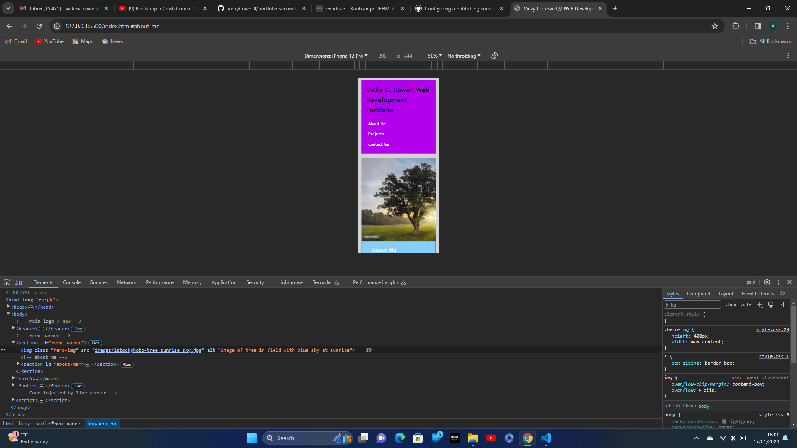
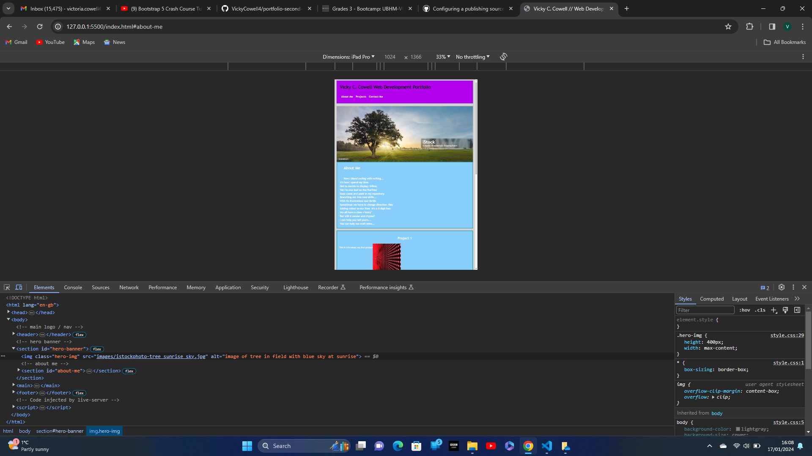
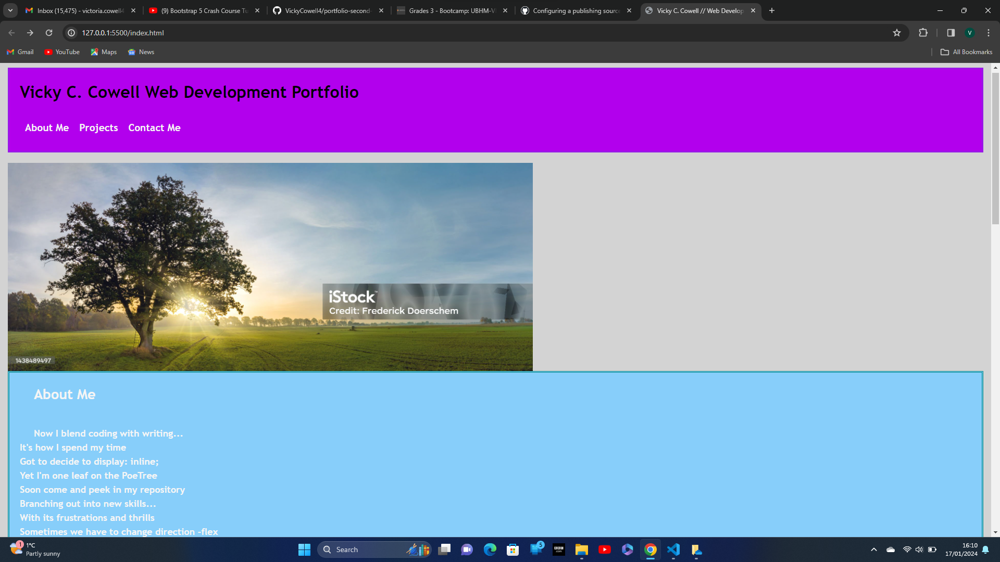

# portfolio-second-submission

## Create a webpage to store your work and projects 

## This is a first attempt at a portfolio webpage to showcase our projects using HTML and CSS

## This one was made without Bootstrap components and with placeholder images for the projects

## Included in project:

* Header/Navbar with list items of About Me, Projects and Contact Me
* About Me section/hero image
* Projects with placeholder text and images
* non-functional/validated contact form with input fields
* footer

## Screenshots

